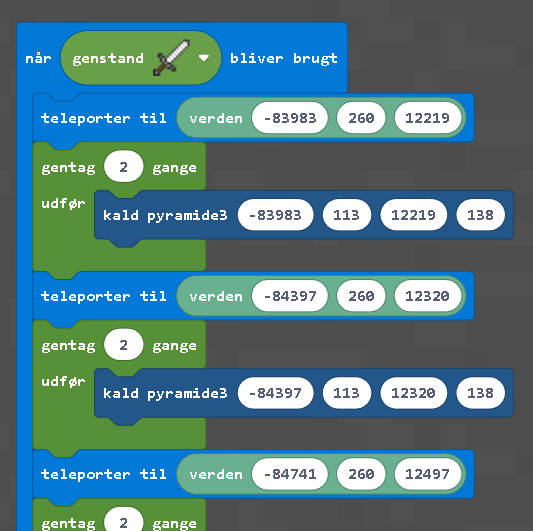
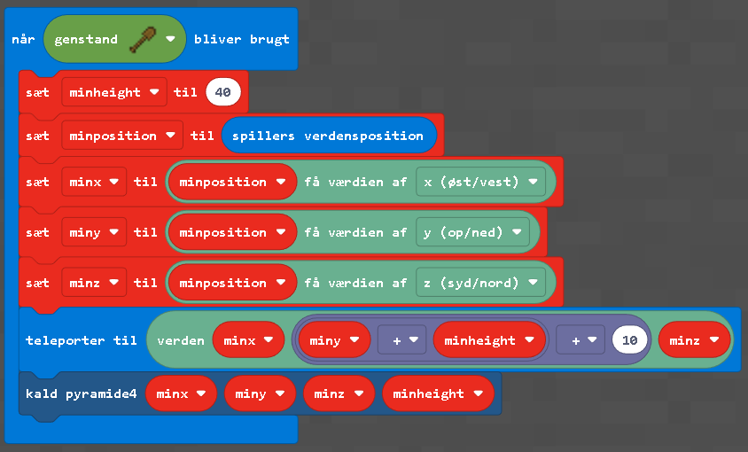

# Gives Pyramider
[![CC BY-NC-SA 4.0][cc-by-nc-sa-shield]][cc-by-nc-sa]


Forløb med Minecraft Education, hvor elever bygger labyrinter i pyramider placeret omkring Give by. For spørgsmål/ uddybning, skriv til <jorti@vejlebib.dk>

* 1.lektion: 30 minutters introduktion til pyramider, labyrinter, minecraft, opdeling i grupper og opstart i verden
* 2.-3.lektion: bygning af labyrinter i pyramider
* 4.lektion: prøve hinandens labyrinter og bruge stopur til at lave et scoreboard på tavlen


# Filer
* [Slides](pyramidecraft-slides.odp)
* Verden uden pyramider: [give.mcworld](https://drive.google.com/file/d/1IxNttfCih3WzaDfkqnkxRn6xIez7zmd3)
* Verden med 12 pyramider: [give-pyramider.mcworld](https://drive.google.com/file/d/1Zh7XnaHkNMFK3JnDOPd-ZERtXND5srbl)

# Sådan er kort, pyramider og NPC'er lavet

## Generering af pyramide
Funktionen pyramide3 kan importeres som blokprogrammering i Minecraft Education. Filen der skal importeres hedder [minecraft-pyramide.mkcd](minecraft-pyramide.mkcd).

Hvis du bruger et jernsværd (bygger med højre museknap når sværdet er valgt) genereres 12 pyramider. Hver pyramide genereres to gange. Det tager åbenbart tid for spilleren at blive teleporteret til en position og i den tid fejler pyramide3-funktionen fordi spilleren skal være indenfor en vis rækkevidde for at der bliver genereret blokke. Derfor bliver pyramiden genereret to gange, så toppen kommer med i anden omgang og ja det er ineffektivt.



### Funktionen pyramide3
Hvert 6.lag i pyramiden ligger dobbelt for at ramme tæt på samme gradantal som Cheops pyramidens hældning har. Pyramiden præsenteret herunder er en ligebenet trekant 138 i højden og 230 i basen, hvilket giver 23 grupper af 6 lag. Det kan f.eks. skitseres med [Solvespace](https://solvespace.com/) som vist herunder:


Pyramide3-funktionen (findes under avanceret og funktioner) tager xyz-koordinater fra grundplan og en højde:


For en visuel repræsentation af hvordan algoritmen virker prøv at bruge træskovlen når koden er aktiveret. Den genererer en pyramide med højde 40:



Pyramide3-funktionen genererer pyramiden fra toppen med en for-løkke der kører fra 0 til højde. Hvert lag i pyramiden er genereret med fire fill-kommandoer. Grunden til det er at en enkelt fill-kommando'en er begrænset til et område på 180x180. En pyramide med højde 138 ender med en base på 276x276.

## Pyramidernes placering
MCA Selector er brugt til at eksportere et [oversigtskort](), som er behandlet i [Inkscape](https://inkscape.org/). Funktionen pyramide3 er kaldt 12 gange for at generere de tolv pyramider, på følgende minecraft koordinater (visualiseret herunder):

[](kort.svg)

|X|Y|Z|
|------|---|-----|
|-84022|117|10789|
|-84283|113|11103|
|-84263|115|11462|
|-84058|115|11776|
|-84100|120|12212|
|-84520|115|12301|
|-84872|117|12490|
|-85384|109|12422|
|-86374|107|11343|
|-86026|102|10884|
|-86277|120|12329|
|-85825|112|12265|

## Teleportere/ NPC'ere
Koordinaterne ovenfor bruges til teleport-kommandoer, så eleverne kan komme fra skolen og til pyramiderne.


Teleporterne laves med et NPC-æg som findes i lageret med tasten e. For at sætte en NPC skal man være worldbuilder og det aktiveres ved at åbne chatten med t og skrive ´´´/worldbuilder´´´

Når ```/worldbuilder``` er aktiveret har man adgang til at redigere NPC-dialogen og indsætte en knap-kommando under avanceret:


|Skolen:|
|-----------------------|
|/tp @p -84443 116 11674|

|Pyramider:|
|-----------------------|
|/tp @p -84022 117 10789|
|/tp @p -84283 113 11103|
|/tp @p -84263 115 11462|
|/tp @p -84058 115 11776|
|/tp @p -84100 120 12212|
|/tp @p -84520 115 12301|
|/tp @p -84872 117 12490|
|/tp @p -85384 109 12422|
|/tp @p -86374 107 11343|
|/tp @p -86026 102 10884|
|/tp @p -86277 120 12329|
|/tp @p -85825 112 12265|


## Danmark i Minecraft
Selve byen er baseret på et udsnit af "Danmark i Minecraft" fra 2014, som er stillet til rådighed af det [Kongelige Bibliotek](https://loar.kb.dk/collections/45f89370-686d-4c56-8f6a-ff35453f24f5). Pakkerne [-180_0.zip](https://loar.kb.dk/items/c0eefb81-07b2-4bc0-9ccc-8d81d6062d4e) og [-180_20.zip](https://loar.kb.dk/items/db6c8659-a58d-47bc-9892-9acc93ad57f0) er downloadet. Regionsfilerne er lagt i samme mappe for at blive udvalgt med [MCA Selector](https://github.com/Querz/mcaselector), eksporteret og konverteret med onlineværktøjet (må max fylde 500mb udpakket) https://chunker.app

## Opsætning af minecraft verden
Opsætningen er delt op i spil og klasse.


### Spil


### Klasseindstillinger


This work is licensed under a
[Creative Commons Attribution-NonCommercial-ShareAlike 4.0 International License][cc-by-nc-sa].

[![CC BY-NC-SA 4.0][cc-by-nc-sa-image]][cc-by-nc-sa]

[cc-by-nc-sa]: http://creativecommons.org/licenses/by-nc-sa/4.0/
[cc-by-nc-sa-image]: https://licensebuttons.net/l/by-nc-sa/4.0/88x31.png
[cc-by-nc-sa-shield]: https://img.shields.io/badge/License-CC%20BY--NC--SA%204.0-lightgrey.svg
